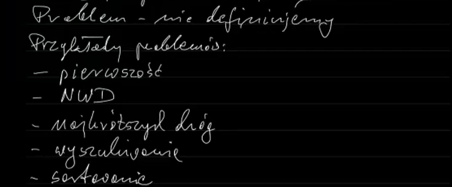
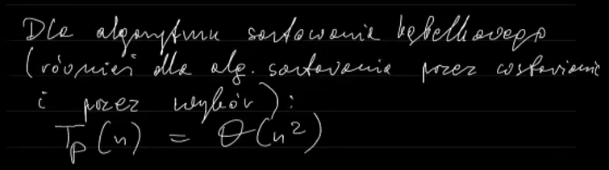
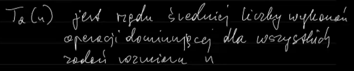

##  przykłady:
 przykład problemu:
 
  
 
 przykład problemu wież Hanoi:
 
  
  
 
 bubble sort - złożoność czasowa średnia,
 [przykład](#bubble-przyklad01) wniosek
 
##  problem jako zbiór zadań:
**zadanie** - szczegóły dotyczące wejścia funkcji / dane z którymi
musimy coś zrobić
 * zadanie problemu jest konkretnym zadaniem do rozwiązania
 * problem pierwszości - zadaniem jest liczba naturalna których jest
   nieskończenie wiele,  
   zadanie to szczegóły dotyczące wejścia funkcji?
   
 ### przykładowe zadania różnych problemów:
  
 
 ## algorytm
  
 
 ## przykład: sformułować algorytm wyszukiwania maksymalnego
  
 
 ## złożoność pamięciowa
 złożonośc pamięciowa to funkcja której argumentami są rozmiary zadań

 ## operacje elementarne i złożone
 niektóre z tych operacji są operacjami elementarnymi, tzn. operacjami
 których nie da się rozłożyc na prostsze, natomiast niektóre są operacjami
 złożonymi, możemy je rozłożyc na operacje prostsze
  
  
  
 
 ## operacje dominujące
  
  
 
 operacje w ostatniej linijce zaznaczone na czerwono nie są operacjami
 dominującymi ponieważ nie zawsze się wykonają
 
 dlaczego więc operacje w pierwszej linijce nie są operacjami
 dominującymi? wykład 3, ~43 min
 
 "Jeżeli mamy w algorytmie dwie zagnieżdżone pętle, tak jak tutaj ^
  to operacja wykonująca się w ostatniej pętli jest operacją dominującą"
 
 ### <a name="bubblesort-O2">znajdowanie wzoru na liczbę operacji dominujących</a>
 
  
 
 ## złożonośc algorytmu
  
 
 ### złożoność pamięciowa
  
 
 ### złożoność czasowa pesymistyczna
  
 
 co ważne: C2 to liczba operacji, nie wykonań
  
  
  
 
 przykłady sortowania ze złożonością O(n2):
  
 
 [Bubble sort - liczenie złożoności pesymistycznej](#bubblesort-O2)
 
 
 ### złożoność czasowa średnia
  
  
 
 tzn. **złożoność czasowa średnia = liczba wykonań operacji dominującej**
 
 #### <a name="bubble-przyklad01">złożoność czasowa średnia - przykład, bubble:</a>
  
 
 ## Podsumowanie
  
 
 --- 
  
 # Wykład 4
