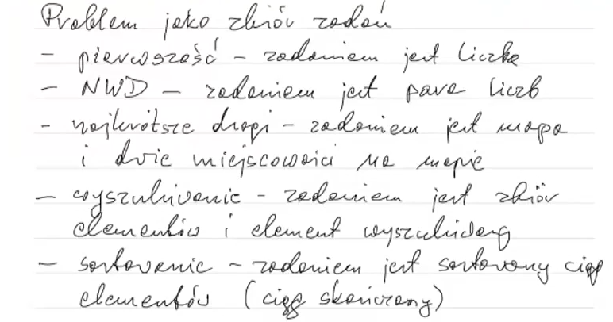
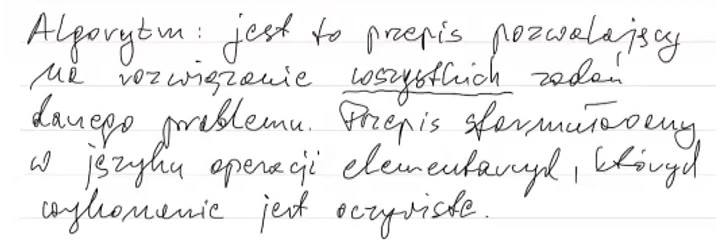
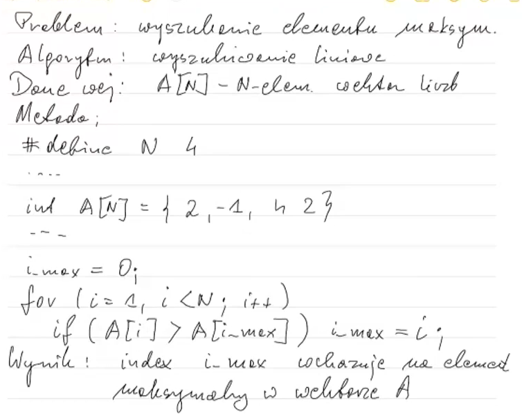

 # Zaliczenie przedmiotu za pomocą projektu

 * **Analiza empiryczna złożoności algorytmów sortowania i wyszukiwania**:
   * dwa z algorytmów:
     * [ ]   sortowania bąbelkowego (bubble),
     * [X]   przez wstawianie (insertion),
     * [X]   przez wybór (selection),
   * jeden z algorytmów:
     * [ ]   szybkiego (quick),
     * [X]   przez scalanie (merge):
   * algorytmy wyszukiwania liniowego i binarnego,
   * trzy typy danych wejściowych: posortowane, posortowane w
     kolejności odwrotnej, kolejność losowa,
   * rozmiary danych wejściowych: n, 2n, 3n, 4n, 5n, 6n, ... gdzie n = rozmiar
    
 * **sprawozdanie**:
   * dokładna informacja o autorstwie programu (można korzystać z
     materiałów z Internetu i z pomocy kolegów, ale konieczna będzie
     dokładna znajomość programu),
   * instrukcja kompilacji i uruchomienia,
   * opis realizacji części źródeł programu odpowiedzialnych za
     analizowane algorytmy i za empiryczną analizę złożoności algorytmów,
   * tabelki/wykresy zależności liczb wykonań operacji od rozmiaru zadania,
    
 * programy w C/C++ w tym analizowane algorytmy w czystym C,
   kompilowane w Visual Studio 2019, oddajemy źródła wszystkich części
   programu (wyjątek stanowią funkcje pomocnicze, np. użyte do
   rysowania wykresów, jeśli zostały użyte),
  
 * **struktura projektu, 4 foldery**:
   * źródła programu z plikiem projektu do kompilacji / budowy programu,
   * program wykonywalny (wersja Release) i konieczne biblioteki,
   * dane (ten folder pewnie będzie pusty),
   * dokumentacja (sprawozdanie wspomniane wyżej, preferowany format pdf),
  
 * program uruchamialny na komputerze z "czystym" systemem Windows,
   tzn. bez konieczności instalacji kompilatora, środowiska
   programistycznego itp.,
 * termin przesłania pliku zip z czterema folderami: 25 czerwca;
   zachęcam do wcześniejszego oddawania programów.
 * **Uwaga**: to są ogólne założenia zaliczenia
   na ocenę bdb, szczegółowe ustalenia pozostawiam Państwu, wszystkie
   rozsądne ustalenia zaakceptuję, zaakceptuję również rozsądną
   modyfikację powyższych założeń. W przypadku watpliwości zapraszam na
   konsultacje.
     
 * **Sprawozdanie musi zawierać następujące elementy**:
   * sformułowanie problemu (wyszukiwanie i sortowanie?),
   * opis problemu,
   * opis rozwiązania,
   * prezentacja wyników,
   * wnioski.

 Sprawozdanie powinno być adresowane do czytelników z ogólną wiedzą
 informatyczną, opisy muszą byc jednozncze. Źródła programu należy
 komentować jednoznacznie, ale oszczędnie.
 

 ## Todo
 * [ ] **Program**:
   * [ ] liczenie operacji - porównanie, przypisanie wartości, deklaracja pamięci
   * [ ] poprawić działanie merge sort
 * [ ] **Sprawozdanie**:
   * Przy każdym algorytmie zapisać:
     * złożoność pamięciowa
     * złożoność obliczeniowa
     * element dominujący, wzór na liczbę jego wykonań

# Notatki
##  przykłady problemów:
  
 
##  problem jako zbiór zadań:
**zadanie** - szczegóły dotyczące wejścia funkcji / dane z którymi
musimy coś zrobić
 * zadanie problemu jest konkretnym zadaniem do rozwiązania
 * problem pierwszości - zadaniem jest liczba naturalna których jest
   nieskończenie wiele,  
   zadanie to szczegóły dotyczące wejścia funkcji?
   
 * przykładowe zadania różnych problemów:
  
 
 ## algorytm
  
 
 ## przykład: sformułować algorytm wyszukiwania maksymalnego
  

# Sprawozdanie
## 1. sformułowanie problemu 
**TODO**: wyszukiwanie i sortowanie?
1. Problem wyszukiwania
  * Zadaniem jest zbiór elementów i element wyszukiwany.
  * Pytanie - czy element należy do zbioru.
  * Umieć porównać dwa elementy
2. Problem sortowania

## 2. opis problemu
## 3. opis rozwiązania
## 4. prezentacja wyników
## 5. wnioski
