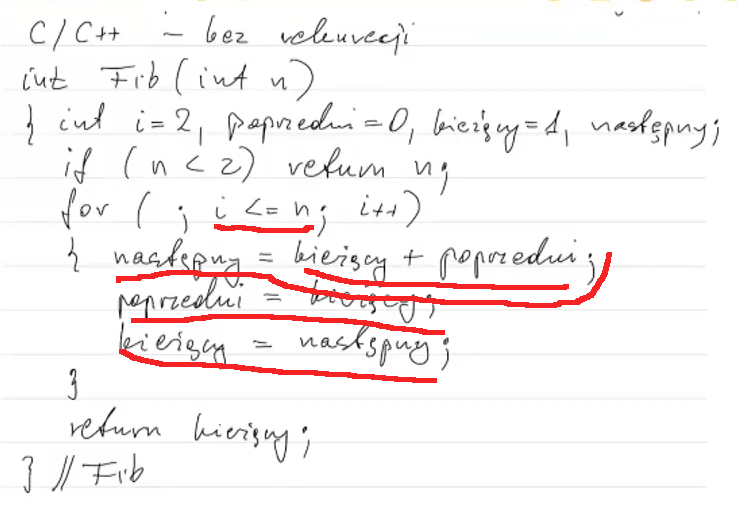

 # Zaliczenie przedmiotu za pomocą projektu

 * **Analiza empiryczna złożoności algorytmów sortowania i wyszukiwania**:
   * dwa z algorytmów:
     * [ ]   sortowania bąbelkowego (bubble),
     * [X]   przez wstawianie (insertion),
     * [X]   przez wybór (selection),
   * jeden z algorytmów:
     * [ ]   szybkiego (quick),
     * [X]   przez scalanie (merge):
   * [X] algorytmy wyszukiwania liniowego i binarnego,
   * trzy typy danych wejściowych: posortowane, posortowane w
     kolejności odwrotnej, kolejność losowa,
   * rozmiary danych wejściowych: n, 2n, 3n, 4n, 5n, 6n, ... gdzie n = rozmiar
    
 * **sprawozdanie**:
   * dokładna informacja o autorstwie programu (można korzystać z
     materiałów z Internetu i z pomocy kolegów, ale konieczna będzie
     dokładna znajomość programu),
   * instrukcja kompilacji i uruchomienia,
   * opis realizacji części źródeł programu odpowiedzialnych za
     analizowane algorytmy i za empiryczną analizę złożoności algorytmów,
   * tabelki/wykresy zależności liczb wykonań operacji od rozmiaru zadania
    
 * programy w C/C++ w tym analizowane algorytmy w czystym C,
   kompilowane w Visual Studio 2019, oddajemy źródła wszystkich części
   programu (wyjątek stanowią funkcje pomocnicze, np. użyte do
   rysowania wykresów, jeśli zostały użyte),
  
 * **struktura projektu, 4 foldery**:
   * źródła programu z plikiem projektu do kompilacji / budowy programu,
   * program wykonywalny (wersja Release) i konieczne biblioteki,
   * dane wejściowe (ten folder pewnie będzie pusty, generowanie),
   * dokumentacja (jedno sprawozdanie wspomniane wyżej, preferowany
     format pdf),
  
 * program uruchamialny na komputerze z "czystym" systemem Windows,
   tzn. bez konieczności instalacji kompilatora, środowiska
   programistycznego itp.,
 * termin przesłania pliku zip z czterema folderami: 25 czerwca;
   zachęcam do wcześniejszego oddawania programów.
 * **Uwaga**: to są ogólne założenia zaliczenia
   na ocenę bdb, szczegółowe ustalenia pozostawiam Państwu, wszystkie
   rozsądne ustalenia zaakceptuję, zaakceptuję również rozsądną
   modyfikację powyższych założeń. W przypadku watpliwości zapraszam na
   konsultacje.
     
 * **Sprawozdanie musi zawierać następujące elementy**:
   * sformułowanie problemu,
   * opis problemu,
   * opis rozwiązania,
   * prezentacja wyników,
   * wnioski.

 Sprawozdanie powinno być adresowane do czytelników z ogólną wiedzą
 informatyczną, opisy muszą byc jednozncze. Źródła programu należy
 komentować jednoznacznie, ale oszczędnie.

--- 

# Dostępne informacje o projekcie

* Zliczasz operacje dominujące, opisujesz algorytmy, robisz dokumentacje
  i w sumie tyle

* **wykład 3**, 01:36:00:
  * Napisać program zliczający liczbę wszystkich operacji elementarnych
    w algorytmie, liczby wykonań operacji dominującej w każdym algorytmie
  * efektem projektu powinny być wykresy liczb w zależności od pewnych
    rozmiarów
  * przykład: dla algorytmu sortowania będziemy sortować ciągi o długości
    "10, 20, 30, 40 i tak dalej", liczby zapisywać i to w wykres
  * wykres liczb w zależności od długości ciągu
  * sprawozdanie:
    * omówić co obliczamy, podać podstawowe dane techniczne, 
      w jakim środowisku zrobione, 

---

 ## Todo
 * generacja wykresów na podstawie otrzymanych danych
 * instrukcja kompilacji
 * sprawozdanie - problemy, rozwiazania, wnioski -
   algorytmy czy problem przedstawienia algorytmów?

 ### Generacja wyników
 * liczenie operacji, które to operacje dominujące?
 * funkcja generująca posortowane i posortowane odwrotnie ciągi
 * dla każdego algorytmu generowanie tablicy różnych rozmiarów 3 typów,
   zapisanie wyników w formie:
   > N=3, random op_e=20 op_d=4; sorted op_e=... ; rsorted ...;
 * porównać do funkcji algorytmu, np O(n2)
  
 * operacje dominujące - wykład 3, dzienne, 18:30;
   wytlumaczenie na koniec
 * można zliczać kilka operacji dominujących, operacją dominującą
   może być jedna operacja lub może być zbiór operacji
  
 
 ### Sprawozdanie:
 * przy każdym algorytmie zapisać:
   * złożoność pamięciowa
   * złożoność obliczeniowa
   * element dominujący, wzór na liczbę jego wykonań

---

# [Notatki](Notatki.md)

---

# Sprawozdanie
1. sformułowanie problemu
## Analiza empiryczna złożoności algorytmów sortowania i wyszukiwania
Celem projektu jest napisanie algorytmów wyszukiwania i
zaprezentowanie ilości operacji elementarnych i dominujących
w zależności od rozmiaru zadania oraz typu danych.

## 2. opis problemu

1. Problem wyszukiwania
  * Zadaniem jest zbiór elementów i element wyszukiwany.
  * Pytanie - czy element należy do zbioru.
  * Konieczna jest możliwość porównania elementów
   
2. Problem sortowania
  * zadaniem jest skończony ciąg.

3. Operacja elementarna to operacje podstawowe, możemy takie wyróżnić
   czytając kod w języku Assembly.
   Do operacji elementarnych należą:
   * operacje matematyczne: + - * / %
   * operacje logiczne: | & ~ || && !
   * operacje relacyjne: == != > >= < <=
   * przypisanie: zmienna = wartość
   * dostęp do elementu tablicy: tablica[index]
   * powrót na początek pętli

4. Operacje dominujące - liczba wykonań wszystkich operacji
   elementarnych może być trudna do wyznaczenia.
   Dlatego określamy operacje dominujące:
   są to takie operacje elementarne, że wykonaniu dowolnej operacji
   elementarnej towarzyszy wykonanie operacji dominującej.

## 3. opis rozwiązania
## 4. prezentacja wyników
## 5. wnioski
